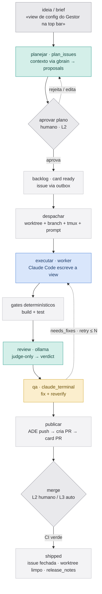

# Gestor — fluxo do loop (brief → shipped)

> Companheiro visual do `docs/PLANO-GESTOR-v1.md`. A tese (D1): **FSM determinística no
> centro** (Rust + SQLite) é dona do controle; o **LLM entra só nas bordas**, em jobs
> tipados. O worker (Claude Code) faz o código; o Gestor coordena. Exemplo threaded nos
> diagramas: o brief *«uma view de config do Gestor na top bar»*.

## Runners

Onde cada LLM roda. O resto (FSM, outbox, build/test, push) é core determinístico, sem modelo.

| Runner | Papel | Lê repo | Skills/browser |
|---|---|---|---|
| **ollama** | bordas (`plan_issues`, `review_diff`, `diagnose_stall`) — modelo puro, ADE supre contexto (git + gbrain) | não | não |
| **claude_headless** (`claude -p`) | gate que precisa explorar o repo, one-shot | sim | skills sim |
| **claude_terminal** (tmux, Tier A) | gate pesado: `/qa` funcional, multi-turn, `fix_and_reverify` | sim | full |
| **worker** (Claude Code, tmux) | executa o código do card | sim | full |

## Caminho feliz

A FSM no centro nunca é LLM — despachar, transicionar e fazer push são código sobre SQLite.
O modelo só aparece nas caixas `ollama`/`terminal`. Os dois únicos gates humanos no L2 são
*aprovar o plano* e *clicar merge* (somem no L3). O `gbrain` no `plan_issues` é o que deixa o
Ollama achar `App.tsx`/`store/settings.ts` sem ter as tools do Claude.

## Caminho de falha

Nada trava o sistema: toda falha tem uma de três saídas — retry bounded, humano no loop, ou
notificação.

```mermaid
flowchart TD
  subgraph A["1 · reprovação nos gates — retry bounded"]
    v["verificar"]:::core -->|needs_fixes| wc["worker corrige"]:::worker
    wc -.->|retry ≤ N| v
    v -->|esgota max_attempts| ai1["awaiting_input · humano"]:::human
  end
  subgraph B["2 · worker travado / precisa de input"]
    w["executar · worker"]:::worker -->|Notification idle/perm| ai2["awaiting_input · humano no pane"]:::human
    w -->|silêncio &gt; stall_timeout| ds["diagnose_stall · ollama"]:::ollama
    ds -->|nudge| back["tmux send_keys → volta a working"]:::core
    ds -->|escalate| ai3["awaiting_input"]:::human
  end
  subgraph C["3 · job ou provider falha — loop não trava"]
    j["gestor_job"]:::core -->|fora do schema| r["1 retry c/ erro anexado"]:::core
    r -->|falhou| n["notificação · loop segue"]:::info
    p["boot · probe do provider"]:::core -->|ausente / velho| off["GESTOR_PROVIDER_MISSING<br/>gestor off · app intacto"]:::danger
  end

  classDef human fill:#e9e9ec,stroke:#9b9ba3,color:#2b2b30;
  classDef core fill:#f3f3f5,stroke:#c2c2c8,color:#2b2b30;
  classDef ollama fill:#d4efe9,stroke:#2f9e8f,color:#14463f;
  classDef worker fill:#d9e6fb,stroke:#4a7fd4,color:#1b3a6b;
  classDef info fill:#d7e9fb,stroke:#4a8fd4,color:#15436b;
  classDef danger fill:#fadcdc,stroke:#d35a5a,color:#6b1515;
```

O ciclo de retry é **bounded** por `max_attempts` — estourou, escala pro humano, nunca tenta
pra sempre. `diagnose_stall` é o único job de auto-recuperação (nudge vs escalate). Job
quebrado vira notificação e o loop segue (não paralisa os outros cards). O invariante que
amarra tudo: *nada falha em silêncio* (D8), e `failed` definitivo só vem depois de esgotar o
retry.

## Refs

- `docs/PLANO-GESTOR-v1.md` — plano completo, decisões D1–D10, jobs tipados
- Épico [#40](https://github.com/MatheusKlauck/ade/issues/40) — espinha do loop (S1–S9)
- [#50](https://github.com/MatheusKlauck/ade/issues/50) — `stage_skills`: runners por gate + `fix_and_reverify`
